# PDI

* Este projeto foi desenvolvido em php, html, css e mysql. Para criar metricas do desenvolvimento profissional e pessoal de todos os colaboradores.
* O sistema possui login;
* O banco de dados encontra-se na pasta mysql, com dados para teste;

## Pasta DOC

* Na pasta docs tem uma apresentação do projeto.

## Login

* Para login de teste utilizar:
    * Usuario: admin
    * Senha: admin
    * Usuario: funcionario.01
    * senha: admin

## Imagens do Projeto

### Login

  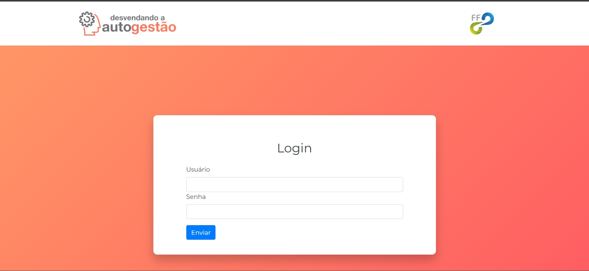

### O Programa

* Na pagina inicial temos uma descrição de todas as fases e do funcionamento do programa.

  

### Avaliação

* Temos a escala da avalição para as perguntas e as avaliações disponiveis para responder;
* Se a avaliação já foi respondida o formulário será desabilitado;
* A avaliação encaminhada pelo líder para seu liderado é multiplicado por 2.

#### Avaliação Líder

* Para o líder será exibido a sua auto avaliação e as avaliações de seus liderados.

  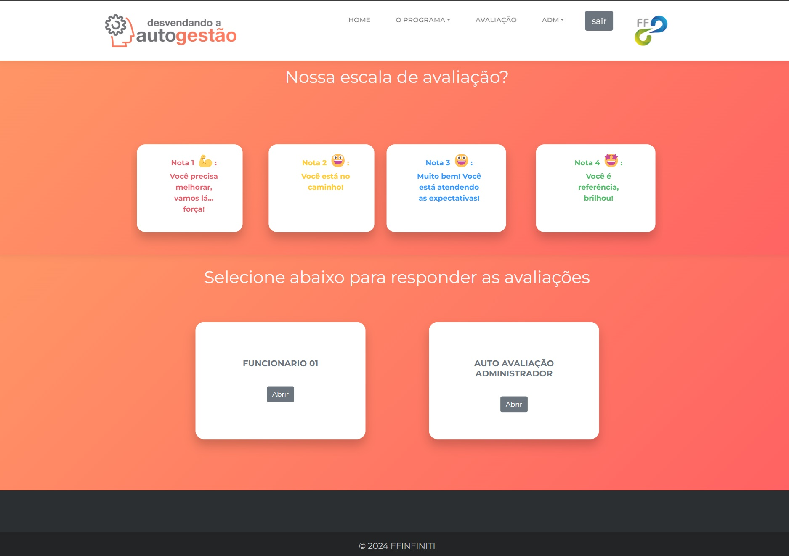

#### Avaliação Liderado

* Para o liderado será exibido apenas sua auto avaliação.

  

#### Perguntas

* Na página de avaliação temos a competência sua descrição e as opções para que o colaborador selecione o peso de acordo com seus critérios de avaliação pessoal.

  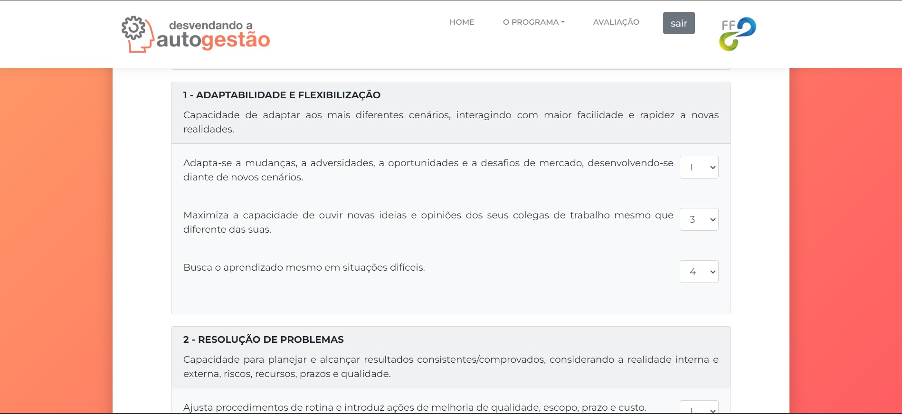

## Administração

* Para administrar o sistema logar com o usuario:
    * Usuario: admin
    * Senha: admin

* Caso queira adicionar novos administradores, deve se atentar de inserir no cargo do funcionario `RH`, foi definido que esse cargo tem permissões de acesso de gestão.
  
  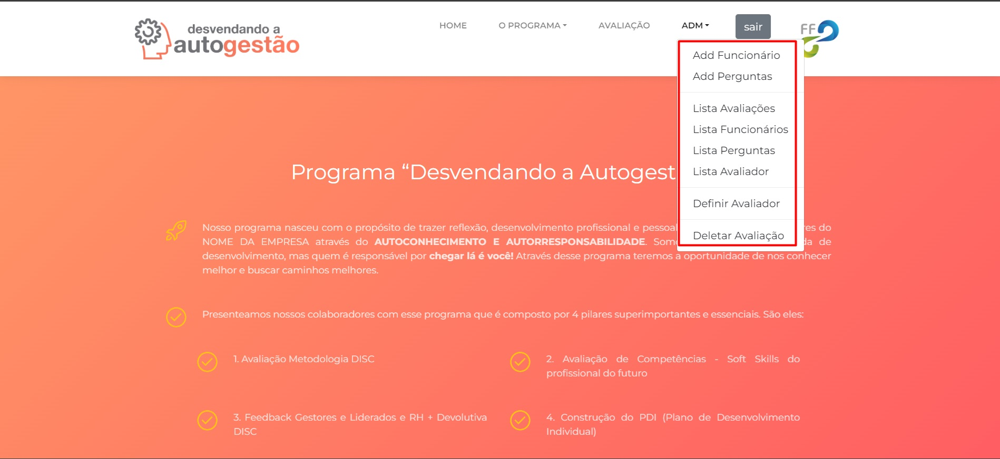

### Add Funcionario

  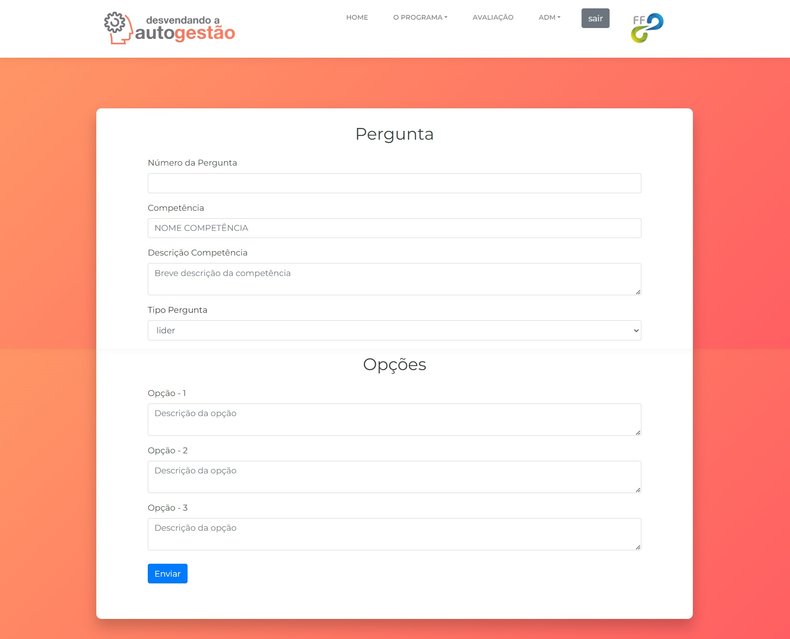

### Add Pergunta

  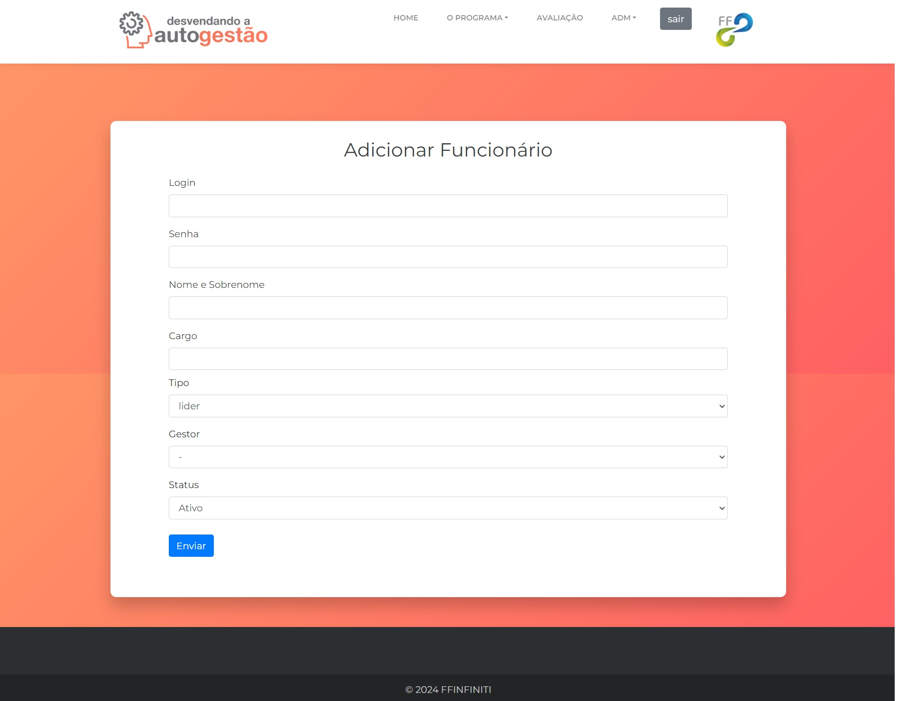

### List Avaliações

* Selecione o funcionário desejado depois em abri.

  

#### Avaliação não respondida

* Caso a avaliação ainda não tenha sido respondida, veremos a página a seguir.

  

#### Avaliação respondida

* Caso a avaliação já tenha sido respondida, veremos a página a seguir;
* Onde conseguimos visualizar a nota de cada competências e suas opções, como sua soma e média;
* Ao final da página podemos visualizar a soma da nota geral e a média;

* Se atente se o líder do colaborador já responder a avaliação de seu liderado para ter o resultado completo. 

  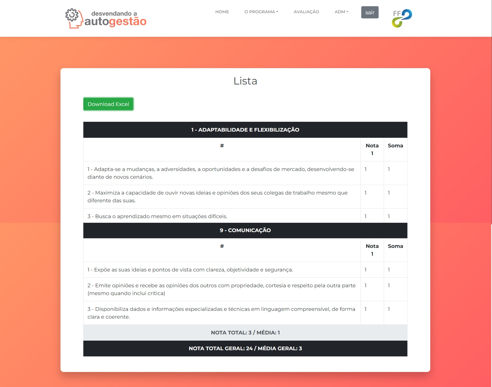

#### Download Excel

* Temos uma opção de `Download Excel`, será aberto uma janela para salvar em seu computador, salve o arquivo e abra com o excel.

  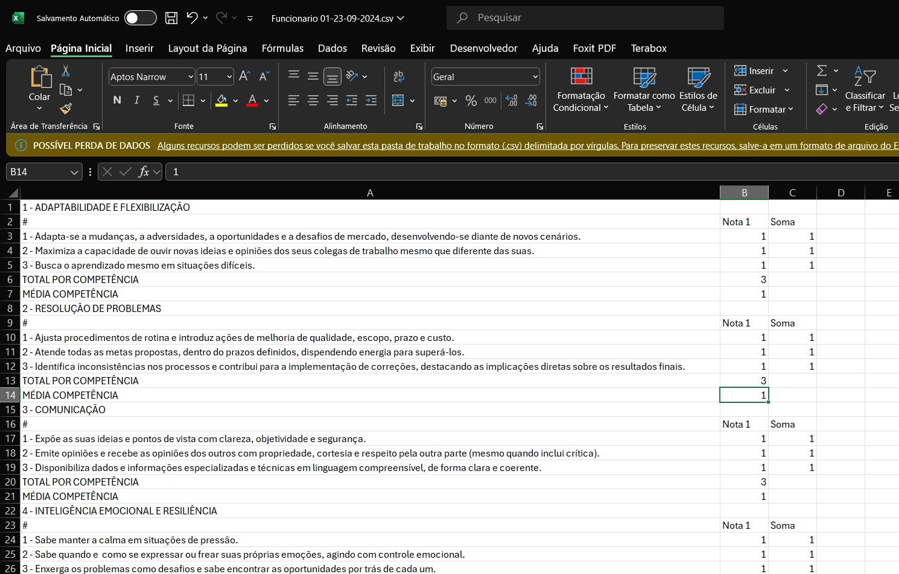

### List Funcionários

* Na lista de funcionários podemos editar, alterar senha ou remover.

  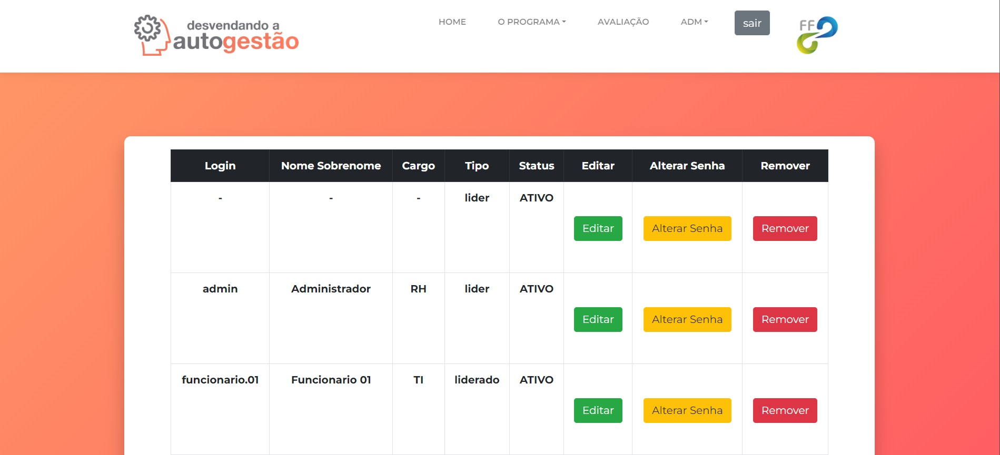

### List Perguntas

* Na lista de perguntas selecionamos primeiro o tipo e depois click em abrir, podemos editar ou remover.

  
  
  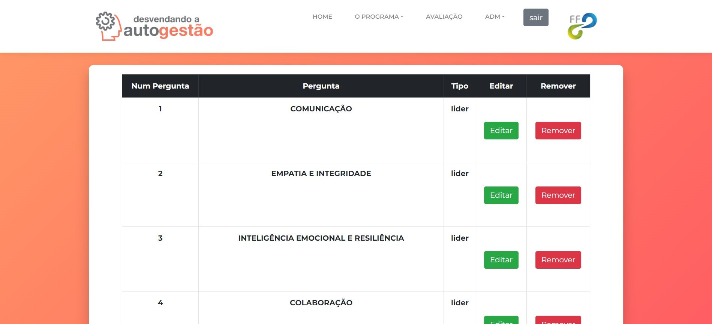

### List Avaliador

* Na lista de avaliador podemos visualizar quem determinado colaborador vai avaliar;
* Selecione o colaborador e depois click em abrir, vamos visualizar quem esse colaborador está avaliando;
* Temos a opção de remover quem será avaliado por este avaliador.

  
  
  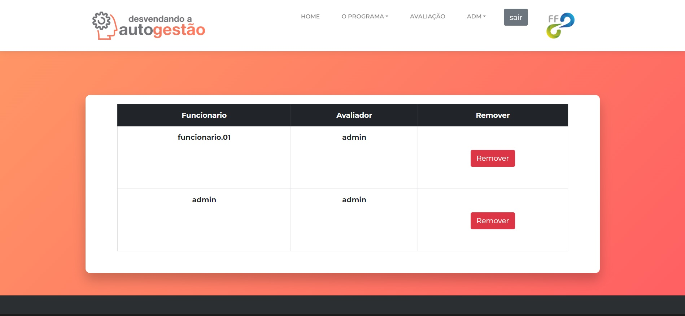

### Definir Avaliador

* Nesta página selecionamos o avaliador e na seção abaixo quem será avaliado pelo colaborador selecionado na seção anterior;

* Feito todas as seleções basta clicar em salvar.

  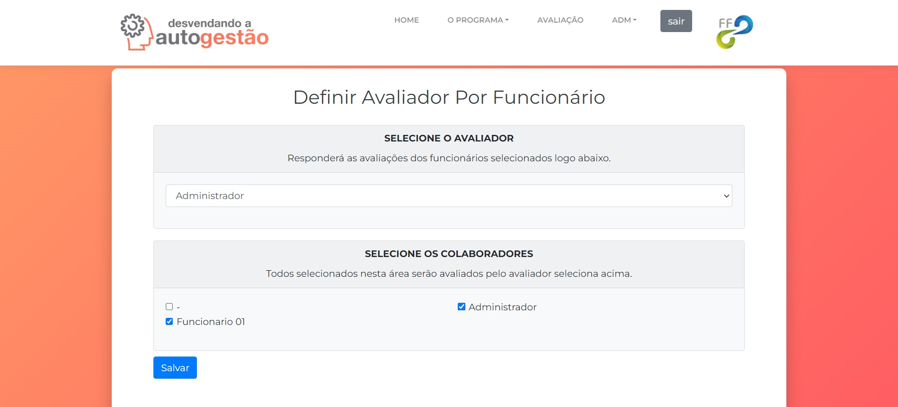

### Deletar Avaliação

* Selecione o colaborador desejado click em abrir, agora basta deletar a avaliação desejada;

  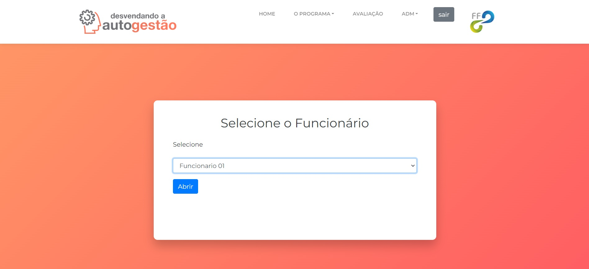

  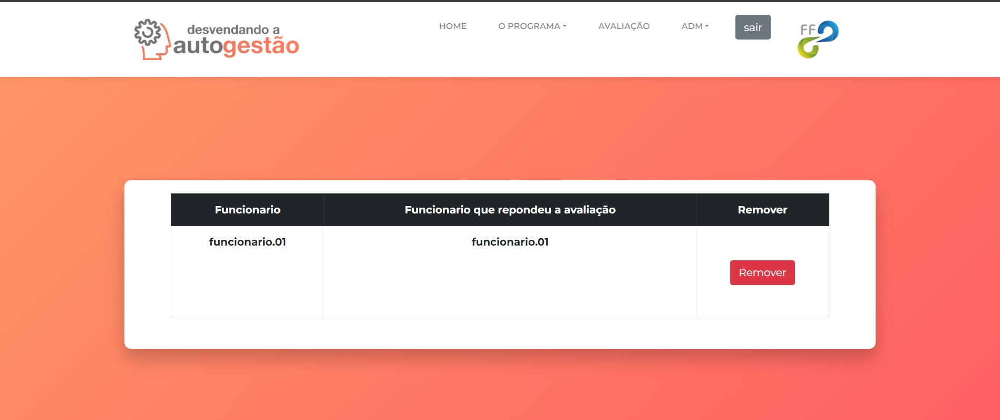
